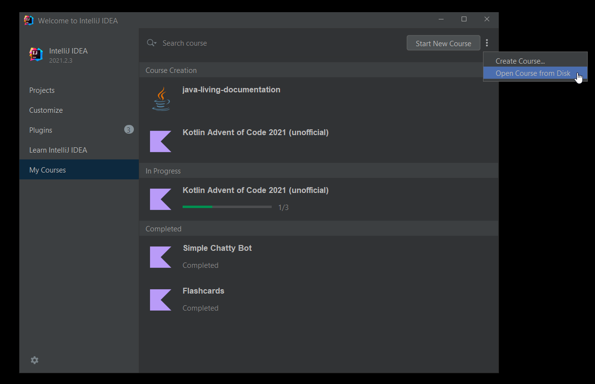

# Kotlin Advent of Code 2021 (unofficial)

**DISCLAIMER: I am not affiliated with the official Advent of code event or website.**

To open this course, you need to use either IntelliJ IDEA Edu or IntelliJ IDEA with Edu tools plugin installed.

Please [follow the installation instructions here](https://plugins.jetbrains.com/plugin/10081-edutools/docs/learner-start-guide.html)
.

Then, you can [download the packaged course zip from releases](https://github.com/marc-bouvier-katas/Kotlin_EduTools_Advent_of_Code_2021/releases) and open it from the IDE as a course "from disk".

## Summary

Advent of Code is an Advent calendar of small programming puzzles for a variety of skill sets and skill levels that can
be solved in any programming language you like. People use them as a speed contest, interview prep, company training,
university coursework, practice problems, or to challenge each other. The presented material is based
on [adventofcode.com](https://adventofcode.com).

You don't need a computer science background to participate - just a little programming knowledge and some problem
solving skills will get you pretty far. Nor do you need a fancy computer; every problem has a solution that completes in
at most 15 seconds on ten-year-old hardware.

If you'd like to support Advent of Code, please go to [adventofcode.com/2021/about](https://adventofcode.com/2021/about)
and follow the instructions once there.

## About spoilers

This course does not contain the answers of the real advent of code problems. I deliberately used partial or different puzzle input for the final acceptation test of each lesson.

## Contribute

If you have suggestions or issues about this Course
please [create an issue here](https://github.com/marc-bouvier-katas/Kotlin_EduTools_Advent_of_Code_2021).

## Other resources

- [Advent of Code Kotlin Template](https://github.com/kotlin-hands-on/advent-of-code-kotlin-template)
- [The Kotlin Blog - Advent of Code 2021 in Kotlin – Win Prizes, Solve Problems, Have Fun!](https://blog.jetbrains.com/kotlin/2021/11/advent-of-code-2021-in-kotlin/)
